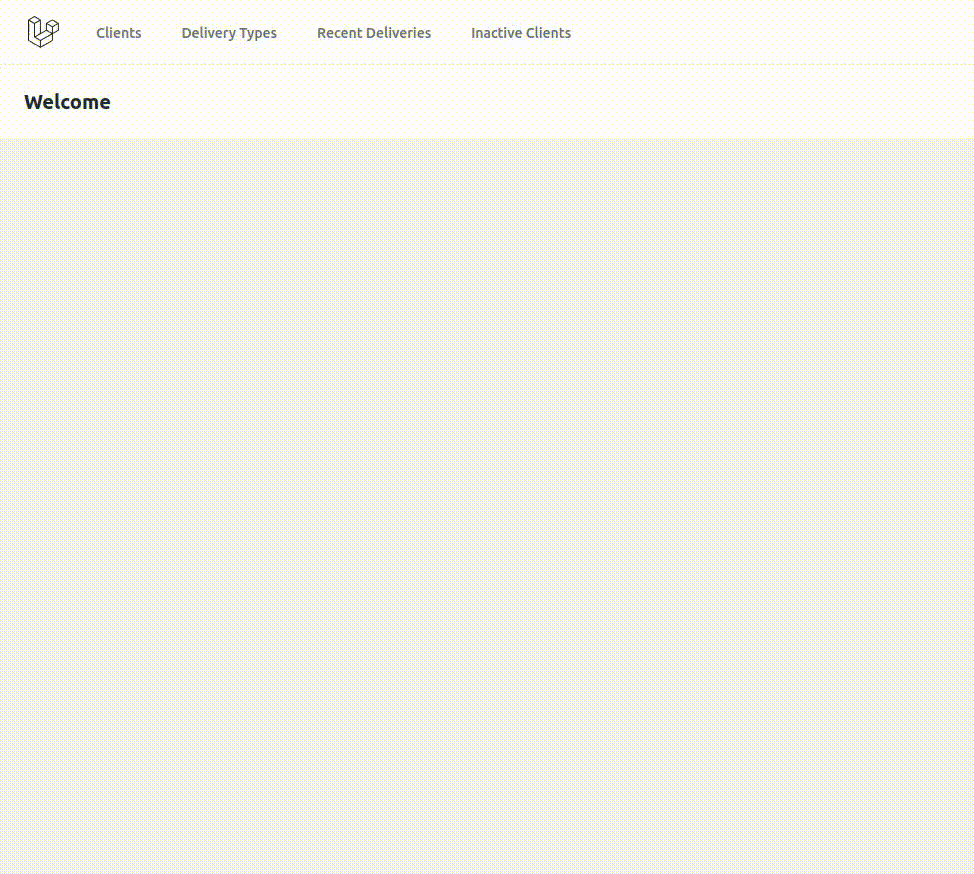

# Intergaz home assignment

### Clients, addresses, deliveries


### Delivery types, recent deliveries, inactive clients


## Technologies used
- PHP 8.0
- mySQL 8.0
- Composer 2.4
- Node.js npm 8.19
- Laravel Framework 9.48

## Instructions
1. Clone this repository and navigate to its directory by using the commands:
   ```
   git clone https://github.com/tomskoralis/intergaz
   cd intergaz/
   ```
2. Install dependencies from composer.json and package.json using the commands:
   ```
   composer install
   npm install
   ```
3. Create a new mySQL database schema.
4. Make a copy of the `.env.example` and rename the copy to `.env`.
5. Enter `DB_DATABASE`, `DB_USERNAME`, `DB_PASSWORD` in the `.env` file to be able to access the schema.
6. Run the migrations and seed the database using the command:
   ```
   php artisan migrate:fresh --seed
   ```
7. Run the Vite development server using the command:
   ```
   npm run dev
   ```
8. Test the application by using the command to run the PHP's built-in development server in another terminal window:
   ```
   php artisan serve
   ```
9. Open the application in a browser by using the url http://127.0.0.1:8000/
